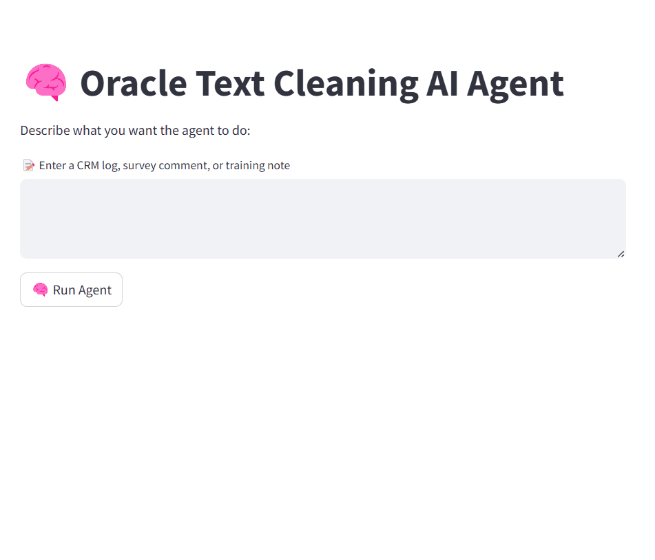
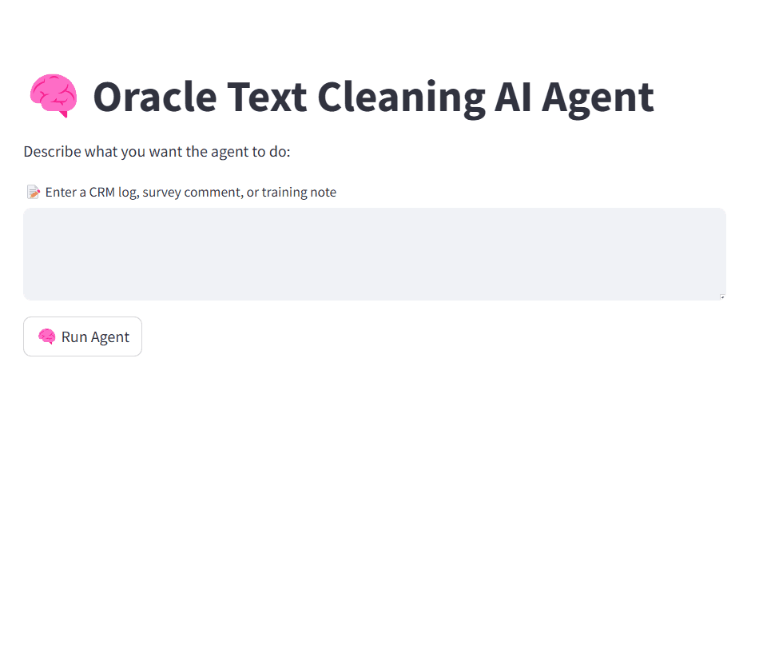

# 🧠 Oracle Text Cleaning AI Agent

[](https://fastapi.tiangolo.com/)
[](https://streamlit.io/)
[](https://ollama.com/library/mistral)
[](#license)

An AI-powered micro-agent that intelligently cleans unstructured text — tailored for enterprise workflows like **CRM logs**, **survey feedback**, and **ML preprocessing**.

> 📍 Powered by FastAPI + Streamlit + LLM (Mistral via Ollama)  
> 🔍 Detects user intent, routes to appropriate cleaning logic, and returns clean, ready-to-use text.

---

## 🚀 Features

- 🤖 LLM intent detection via `Mistral` (running locally with `ollama`)
- 🔄 Dynamic routing to one of 3 Oracle-style use cases:
  - CRM Ticket Cleaning
  - Survey Feedback Normalization
  - Model Input Preprocessing
- 🧼 Text cleaning with:
  - Contraction expansion
  - Lemmatization
  - Stopword removal
  - Deduplication (batch mode)
- 💻 Clean Streamlit UI to test and visualize everything

---

## 🧠 Quick Demo


### 📺 Streamlit Agent UI in Action



### 🤖 LLM-Powered Routing (FastAPI Response Preview)



---

## ⚙️ How to Run

### 1. Install dependencies

```bash
pip install -r requirements.txt
Also install Ollama, then run:

ollama pull mistral

### 2. Start FastAPI Backend
uvicorn app.main:app --reload

📍 Opens at: http://127.0.0.1:8000/docs

### 3. Start Streamlit UI

streamlit run streamlit_ui/app.py

📍 Opens at: http://localhost:8501
💬 Try This Example:

I can’t log into Oracle CRM — says my credentials are invalid!

✅ Output:

    Intent: CRM_CLEANING

    Cleaned: cannot log oracle crm credential invalid


⚠️ License

This project is NOT open-source.
You may NOT copy, use, distribute, or modify this code for any purpose — personal or commercial — without express written permission from the creator.

© All rights reserved by Aadhiya
